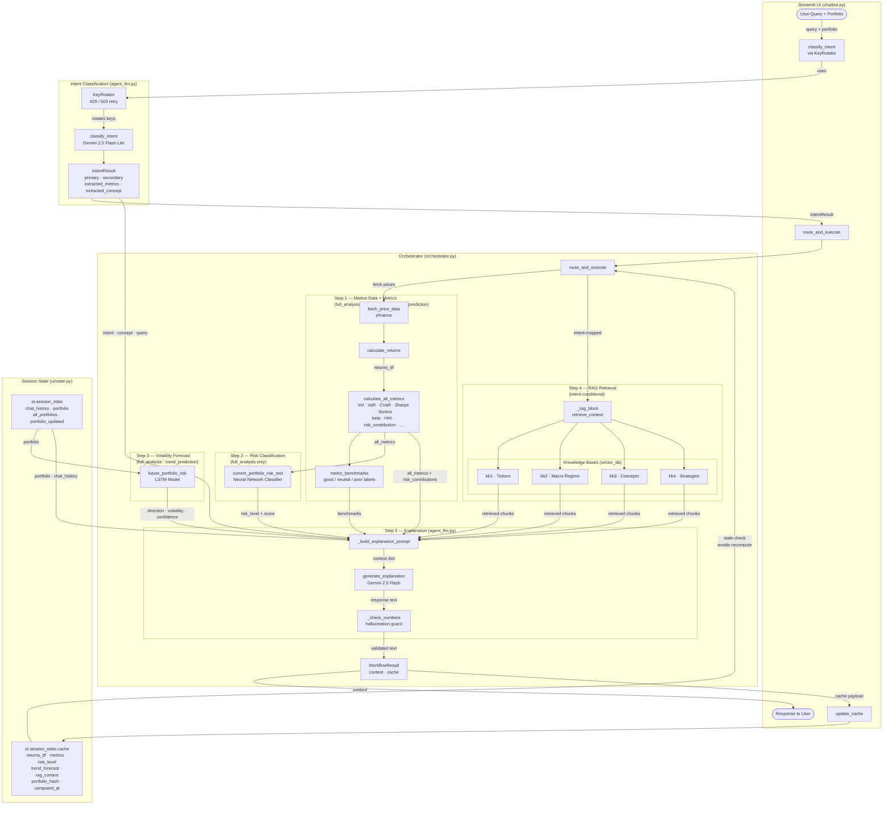

# dsa4265-group-5-Portfolio-Risk-Analyst-Chatbot
Portfolio Risk Analyst Chatbot using AI agent and various tools!

## Portfolio Risk Analyst Chatbot — Architecture

### Component Index

| Component | File | Role |
|---|---|---|
| `chatbot.py` | `chatbot.py` | Streamlit entry point, session orchestration |
| `classify_intent` | `agent_tools/workflow_tools/agent_llm.py` | Intent classification via Gemini 2.5 Flash-Lite |
| `KeyRotator` | `agent_tools/workflow_tools/agent_llm.py` | API key rotation on 429/503 errors |
| `route_and_execute` | `agent_tools/workflow_tools/orchestrator.py` | Main orchestration pipeline |
| `fetch_price_data` | `agent_tools/data_tools/` | Price history via yfinance |
| `calculate_returns` | `agent_tools/data_tools/` | Returns computation |
| `calculate_all_metrics` | `agent_tools/quant_tools/` | Vol, VaR, CVaR, Sharpe, Sortino, beta, HHI, risk_contribution, etc. |
| `metric_benchmarks` | `agent_tools/quant_tools/` | good / neutral / poor labels per metric |
| `current_portfolio_risk_tool` | `agent_tools/ml_risk_tools/` | Neural network risk classifier (takes portfolio + all_metrics) |
| `future_portfolio_risk` | `agent_tools/ml_risk_tools/` | LSTM volatility direction forecast (takes portfolio) |
| `retrieve_context` | `agent_tools/rag_tools/` | Vector search over kb1–kb4 knowledge bases |
| `_check_numbers` | `agent_tools/workflow_tools/agent_llm.py` | Post-generation hallucination guard |
| `generate_explanation` | `agent_tools/workflow_tools/agent_llm.py` | Final LLM response via Gemini 2.5 Flash |
| `update_cache` | `ui/state.py` | Persists computed data to session state |

### Intent Routing

| Intent | Step 1 | Step 2 | Step 3 | Step 4 (RAG) |
|---|:---:|:---:|:---:|:---:|
| `full_analysis` | yes | yes | yes | yes (`full_analysis` intent) |
| `specific_metric` | yes | — | — | conditional (`concept_explanation` intent) |
| `trend_prediction` | yes | — | yes | yes (`trend_prediction` intent) |
| `concept_explanation` | — | — | — | yes (`concept_explanation` intent) |
| `follow_up` | — | — | — | conditional (`concept_explanation` intent) |
| `general_chat` | — | — | — | — |
